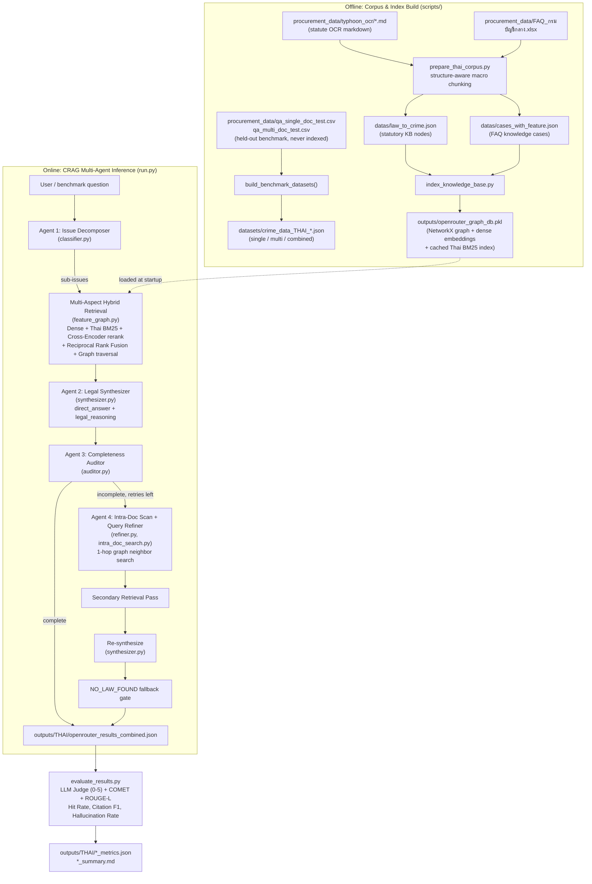

# LegalGraphRAG: Multi-Agent Corrective RAG (CRAG) for Thai Government Procurement Law

> **An advanced legal question-answering and statutory retrieval system for Thai Government Procurement laws and regulations.**
> Powered by an active **Multi-Agent Corrective RAG (CRAG)** architecture combining **Multi-Aspect Hybrid Retrieval (Dense Vector + Thai BM25 + GPU Cross-Encoder Reranking)** and **Knowledge Graph Traversal**.
>
> This repository is a domain adaptation of a general-purpose **LegalGraphRAG** framework originally built for Chinese criminal-law case retrieval (CAIL / JuDGE / CMDL datasets). See [REPORT.md](REPORT.md) for the full technical report on the adaptation, architecture, and current gaps between docs and code.

---

## 🚀 **Key Highlights**

- ✅ **Multi-Agent CRAG Architecture** (see [core/crag/pipeline.py](core/crag/pipeline.py) `CRAGPipeline.process_case_item`):
  1. **Issue Decomposer & Intent Classifier (Agent 1 — [classifier.py](core/crag/classifier.py))**: Decomposes complex procurement inquiries into atomic sub-questions (`sub-issues`), preventing dominant topics from masking secondary issues during search.
  2. **Multi-Aspect Hybrid Retrieval ([feature_graph.py](core/graph_construct/feature_graph.py))**: Concurrently queries dense vector embeddings, tokenized Thai BM25, GPU Cross-Encoder reranker (`BAAI/bge-reranker-v2-m3`), and graph clusters with reciprocal score fusion. Runs once for the primary query and once per sub-issue.
  3. **Legal Synthesizer & Adjudicator (Agent 2 — [synthesizer.py](core/crag/synthesizer.py))**: Formulates grounded legal judgments, strictly separating a concise `direct_answer` from detailed `legal_reasoning`.
  4. **Completeness & Grounding Auditor (Agent 3 — [auditor.py](core/crag/auditor.py))**: Audits whether all sub-issues are comprehensively addressed and explicitly substantiated by retrieved statutory clauses.
  5. **Intra-Doc Scan + Targeted Query Refiner (Agent 4 — [refiner.py](core/crag/refiner.py), [intra_doc_search.py](core/crag/intra_doc_search.py)) with Active Feedback Loop (`max_retry=1`)**: Re-scans already-retrieved documents, constructs focused search queries, and traverses 1-hop graph neighbors for missing statutory aspects, triggering a secondary retrieval + re-synthesis pass.
- ✅ **Clean Direct Answer**: `direct_answer` provides an unambiguous, straightforward summary free of statutory section numbers (e.g. no "มาตรา" or "ข้อ" clutter), keeping all legal citations structured in `applicable_laws`.
- ✅ **3-Tier NO_LAW_FOUND Guardrails**: Detects out-of-scope inquiries across three defensive layers: pre-LLM retrieval emptiness, LLM prompt guidelines, and post-processing override ([judge_crime.py](core/judge/judge_crime.py) `FALLBACK_NO_LAW_ANSWER`).
- ✅ **Comprehensive Benchmark Evaluator** ([evaluation/evaluate_results.py](evaluation/evaluate_results.py)): Evaluates legal answer quality using an LLM Judge (0–5 rubric), optional COMET and ROUGE-L, measuring:
  - Strict Hit Rate (Doc & Section Recall@k)
  - Citation Precision, Recall, and F1
  - Rule & Penalty Correctness
  - Completeness vs Ground Truth
  - Hallucination-Free Rate
  - Verbosity / Word Length Ratio

---

## 🧭 **Architecture & Data Flow**



---

## 🧩 **Project Structure**

```text
LegalGraphRAG_procurement/
├── core/
│   ├── LegalGraphRAG.py       # Main LegalGraphRAG engine + LegalGraphRAGConfig (Model/Data/Retrieve/Graph/CRAG)
│   ├── models/                # LLM client wrappers (OpenRouter/OpenAI-compatible)
│   ├── crag/                  # Multi-Agent Corrective RAG Package
│   │   ├── classifier.py      # Agent 1: Issue Decomposer & Intent Classifier
│   │   ├── synthesizer.py     # Agent 2: Legal Synthesizer & Adjudicator
│   │   ├── auditor.py         # Agent 3: Completeness & Grounding Auditor
│   │   ├── refiner.py         # Agent 4: Query Refiner & Graph Neighbor Search
│   │   ├── intra_doc_search.py# Targeted re-scan of already-retrieved documents before Agent 4
│   │   └── pipeline.py        # CRAG Orchestrator (Multi-Aspect Search & Retry Loop)
│   ├── graph_construct/       # Knowledge graph construction and retrieval
│   │   ├── feature_graph.py   # Hybrid Search (Dense + BM25 + Cross-Encoder Reranker + RRF)
│   │   └── graph_db.py        # NetworkX In-Memory Graph Database
│   ├── judge/                 # Legal judgment & guardrails (judge_crime.py, judge_law.py)
│   ├── preprocess/            # Procurement entity & feature extraction (case_seg.py, get_features.py, preJudge.py)
│   ├── prompt/                # Unified prompt registry
│   │   ├── crag/               # Prompts for Decomposer, Auditor, and Refiner
│   │   ├── graph/               # Prompts for graph-aware retrieval
│   │   ├── judge/               # Prompts for Legal Synthesizer
│   │   └── preprocess/          # Prompts for Procurement Features
│   └── utils/                 # Utilities and pipeline helper functions
├── scripts/
│   ├── prepare_thai_corpus.py   # Builds datas/*.json + datasets/*.json from procurement_data/
│   ├── index_knowledge_base.py  # Runs corpus prep + builds outputs/openrouter_graph_db.pkl
│   ├── recalculate_metrics.py   # Re-scores an existing results file without re-running inference
│   └── merge_retrieval_corpus.py# Legacy: merges CAIL/JuDGE/CMDL (Chinese criminal-law) corpora.
│                                 # Not used by the Thai procurement pipeline — kept from the upstream project.
├── procurement_data/  [gitignored — supply locally]
│   ├── typhoon_ocr/             # OCR'd Thai statute markdown, source of the knowledge graph
│   ├── FAQ_กรมบัญชีกลาง.xlsx     # Comptroller General's Dept. FAQ Q&A, source of `cases_with_feature.json`
│   ├── qa_single_doc_test.csv   # Held-out benchmark: single-statute questions
│   └── qa_multi_doc_test.csv    # Held-out benchmark: cross-statute questions
├── datas/
│   ├── law_to_crime.json      # Knowledge base of Thai procurement statutory clauses (generated)
│   └── cases_with_feature.json# FAQ-derived consultation cases (generated; test CSVs are never mixed in)
├── datasets/
│   ├── crime_data_THAI_small.json         # Combined benchmark (single + multi)
│   ├── crime_data_THAI_single_small.json  # Single-statute questions only
│   └── crime_data_THAI_multi_small.json   # Cross-statute questions only
├── evaluation/
│   └── evaluate_results.py    # Benchmark evaluation script (LLM Judge + COMET + ROUGE-L + statistical metrics)
├── docs/
│   └── TABLE2_REPRODUCTION.md # Legacy: reproduction notes for the original Chinese criminal-law
│                                 experiment (CAIL/JuDGE/CMDL). Not applicable to this procurement fork.
├── configs/            [gitignored — create from env.example]
│   └── thai_procurement.env   # Model, API keys, retrieval top-k, and reranker settings
├── outputs/            [gitignored — generated by scripts/run.py]
│   ├── openrouter_graph_db.pkl        # Cached in-memory graph + dense embeddings + BM25 index
│   └── THAI/                          # Per-run inference results and evaluation reports
├── env.example                 # Template — copy to configs/thai_procurement.env
├── run.py                      # Main CLI execution pipeline
└── README.md
```

> **Note:** `configs/`, `outputs/`, and `procurement_data/` are all listed in `.gitignore` and are **not present in a fresh checkout**. You must create `configs/thai_procurement.env` (from `env.example`) and supply `procurement_data/` yourself; `outputs/` is generated the first time you run the indexing or inference scripts.

---

## 🛠️ **Installation & Usage**

### 1️⃣ Dependencies

Install required packages (Python 3.10+):

```bash
pip install -r requirements.txt
```

> **Note for GPU Reranker**:
> Ensure CUDA-compatible `torch` and `sentence-transformers` are installed for accelerating `BAAI/bge-reranker-v2-m3`.

---

### 2️⃣ Environment Configuration (`configs/thai_procurement.env`)

`configs/` is gitignored, so create it yourself from the template:

```bash
mkdir -p configs
cp env.example configs/thai_procurement.env
```

Then fill in your keys (`env.example` values shown, adjust as needed):

```ini
# OpenRouter / OpenAI API Configuration
model_name=openrouter:google/gemini-2.5-flash
OPENROUTER_API_KEY=your_openrouter_api_key
OPENROUTER_BASE_URL=https://openrouter.ai/api/v1

# Embedding Service (Ollama / Local)
embedding_api_url=http://localhost:11434/api/embed
embedding_model=unsloth/embeddinggemma-300m

# Graph & Retrieval Settings
graph_db_path=./outputs/openrouter_graph_db.pkl
top_retrieve_top_k=3
direct_retrieve_top_k=5
reranker_model=BAAI/bge-reranker-v2-m3
reranker_device=cuda:0
reranker_threshold=-4.0

# CRAG Multi-Agent Loop
crag_enabled=true
crag_max_retry=1
```

---

### 3️⃣ Build the Corpus & Knowledge Graph (`scripts/`)

The Thai statute corpus and the knowledge graph are **not checked into the repo** — you must supply `procurement_data/` (OCR'd statute markdown in `typhoon_ocr/`, the FAQ Excel file, and the `qa_*.csv` benchmark files) and build the index locally:

```bash
# One-shot: chunk statutes/FAQ, build datas/*.json, build datasets/*.json,
# and build/cache outputs/openrouter_graph_db.pkl
python scripts/index_knowledge_base.py --force

# Or, to only regenerate datas/*.json and datasets/*.json without touching the graph DB:
python scripts/prepare_thai_corpus.py
```

This is a one-time step (re-run with `--force` whenever `procurement_data/` changes); `run.py` can reuse the cached graph afterwards.

---

### 4️⃣ Running LegalGraphRAG (`run.py`)

Execute the pipeline on the evaluation dataset. Use `--no-build-graph` to load the pre-built knowledge graph from step 3 instead of rebuilding it:

```bash
python run.py --no-build-graph
```

Useful flags (see `run.py --help`):

| Flag | Default | Description |
| :--- | :--- | :--- |
| `--model` | `openrouter` | Model to use (e.g. `google/gemma-3-4b-it`, `qwen3`, `gpt4o_mini`) |
| `--dotenv_path` | `configs/thai_procurement.env` | Path to the env config file |
| `--datasets` | `THAI` | Which `datasets/crime_data_<name>_small.json` to run, or a direct file path |
| `--datasets_path` | `./datasets` | Directory containing the dataset JSON files |
| `--limit` | `None` | Cap the number of questions processed (useful for smoke tests) |
| `--workers` | `4` | Concurrent inference worker threads |
| `--devices` | `None` | GPU devices for the reranker (e.g. `cuda:0 cuda:1`) |
| `--no-build-graph` | off | Skip graph construction; load the cached `.pkl` instead |
| `--force-rebuild` | off | Force-rebuild the graph even if the cache exists |

Execution steps performed automatically:

1. Loads the NetworkX In-Memory Knowledge Graph from `outputs/openrouter_graph_db.pkl` (or builds it if missing and `--no-build-graph` is not set).
2. Builds and caches the Thai BM25 index alongside dense embeddings.
3. Dispatches inquiries through the **CRAG Multi-Agent Loop**.
4. Outputs structured legal predictions and `crag_meta` diagnostics to `outputs/THAI/openrouter_results_combined.json`.

For a quick smoke test against the cross-statute benchmark you inspected in `procurement_data/qa_multi_doc_test.csv`, point `--datasets` at the generated multi-doc split:

```bash
python run.py --no-build-graph --datasets THAI_multi --limit 5
```

---

### 5️⃣ Benchmark Evaluation (`evaluate_results.py`)

Evaluate the generated answers against ground-truth legal principles using the LLM Judge (auto-detects the latest `outputs/THAI/*_results_combined.json` if `--input` is omitted):

```bash
python evaluation/evaluate_results.py
```

Additional flags:

| Flag | Default | Description |
| :--- | :--- | :--- |
| `--input` / `-i` | latest `outputs/THAI/*_results_combined.json` | Results file to evaluate |
| `--judge-model` / `-j` | `google/gemini-3.8-flash` | LLM used for the 0–5 rubric judge |
| `--disable-judge` | off | Skip the LLM judge to save time/API cost |
| `--enable-comet` | off | Also compute COMET semantic-similarity scores (downloads a model) |
| `--workers` / `-w` | `4` | Concurrent judge-evaluation threads |

Outputs generated:

- `<input_stem>_eval.json` (e.g. `outputs/THAI/openrouter_results_combined_eval.json`): Detailed per-question metric logs.
- `<input_stem>_summary.md`: Comprehensive evaluation report with summary tables, 0–5 quality scores, completeness breakdown, and qualitative critiques.

---

## 📊 **Evaluation Metrics**

| Category                    | Metric                                     | Description                                                                                     |
| :-------------------------- | :----------------------------------------- | :---------------------------------------------------------------------------------------------- |
| **Retrieval Quality** | **Strict Hit Rate**                  | Exact recall matching BOTH the statutory document and section number (Doc AND Section Recall@k) |
| **Retrieval Quality** | **Section Hit Rate**                 | Proportion of inquiries where the required section is retrieved in Top-K candidates             |
| **Legal QA Score**    | **Average Score (0–5)**             | Overall response quality based on the Thai Legal QA rubric (Good / Perfect:$\ge$ 4/5)         |
| **Citation Quality**  | **Citation Precision / Recall / F1** | Accuracy and completeness of cited statutory clauses                                            |
| **Substance & Fact**  | **Rule / Penalty Correctness**       | Accuracy of statutory numbers, budget thresholds, deadlines, and penalties                      |
| **Substance & Fact**  | **Completeness vs GT**               | Full coverage of sub-questions, statutory conditions, and exceptions                            |
| **Trustworthiness**   | **No Hallucination Rate**            | Freedom from fabricated clauses or unsupported legal assertions                                 |
| **Conciseness**       | **Word Length Ratio**                | Ratio of agent word count relative to ground truth (measuring conciseness)                      |

---

## 📄 **License & Acknowledgments**

This project extends the original LegalGraphRAG framework — a Multi-Agent CRAG system originally built for Chinese criminal-law retrieval over the CAIL, JuDGE, and CMDL datasets (see `docs/TABLE2_REPRODUCTION.md` for that lineage) — re-architecting it for the **Public Procurement and Supplies Administration Act, B.E. 2560 (2017)** (พระราชบัญญัติการจัดซื้อจัดจ้างและการบริหารพัสดุภาครัฐ พ.ศ. 2560) and related Ministry of Finance regulations of Thailand.

For a deeper technical walkthrough of what changed in this adaptation, remaining legacy naming/code, and how the pieces fit together, see **[REPORT.md](REPORT.md)**.

To run this system as an MCP sub-agent (e.g. for a larger orchestrator to call), including the Dockerfile, docker-compose setup, and how to test it, see **[MCP.md](MCP.md)**.
