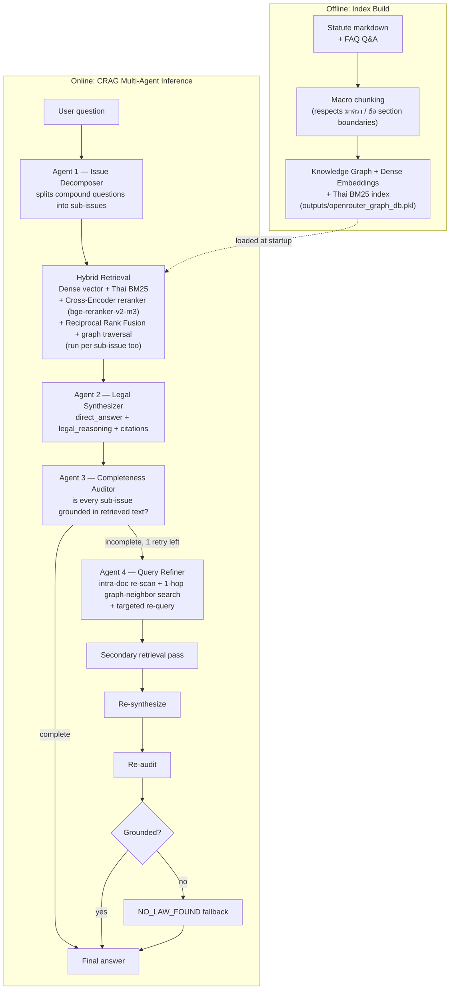

# Technical Report: The LegalGraphRAG RAG System

## 1. Overview

LegalGraphRAG answers Thai procurement-law questions using a **Multi-Agent Corrective RAG (CRAG)** loop: a question is decomposed, searched with hybrid retrieval, answered, audited for completeness, and — if incomplete — re-searched and re-answered once more before returning a final grounded response.

There are two phases: an **offline index build** (statutes → knowledge graph + vector/BM25 index) and an **online inference loop** (question → multi-agent CRAG → answer).

---

## 2. Architecture

---

## 3. The agents

1. **Issue Decomposer (Agent 1 — `classifier.py`)** — splits a compound inquiry into atomic sub-questions (`sub-issues`) so a dominant topic doesn't crowd out secondary ones during search, and extracts structured procurement features from the question.
2. **Hybrid Retrieval (`feature_graph.py`)** — not an agent per se, but the shared search step every agent calls into. Runs dense vector search, tokenized Thai BM25, and a GPU cross-encoder reranker (`BAAI/bge-reranker-v2-m3`) concurrently, fuses the ranked lists with reciprocal rank fusion, and pulls in graph-adjacent clauses. Executed once for the full question and once per sub-issue.
3. **Legal Synthesizer (Agent 2 — `synthesizer.py`)** — drafts the answer, strictly separating a plain-language `direct_answer` from the detailed `legal_reasoning`, with citations kept in a structured `applicable_laws` list.
4. **Completeness Auditor (Agent 3 — `auditor.py`)** — checks whether every sub-issue from Agent 1 is both addressed and explicitly grounded in the retrieved statutory text; flags `missing_issues` if not.
5. **Query Refiner (Agent 4 — `refiner.py` + `intra_doc_search.py`)** — only fires when Agent 3 finds gaps and a retry is still available (`max_retry=1`). It first re-scans documents already retrieved (cheap), then builds targeted follow-up queries and walks 1-hop graph neighbors for the missing statutory aspects, triggering a second retrieval pass. Agent 2 re-synthesizes and Agent 3 re-audits once more before the loop ends.

## 4. Guardrails

A `NO_LAW_FOUND` fallback gate runs after the loop completes, checking three independent signals — the synthesizer's own status, whether the auditor found *all* issues lack any legal basis, and whether the auditor explicitly recommended fallback — before allowing a "no applicable law" response through. This prevents both false negatives (giving up when law actually exists) and hallucinated citations (answering confidently with no grounding).

## 5. Evaluation

Answers are scored against a held-out Thai QA benchmark using:

- **Retrieval metrics**: Strict Hit Rate (must match both the correct statute *and* section number) and Section Hit Rate @ top-k.
- **Generation metrics**: an LLM-as-judge 0–5 rubric, citation precision/recall/F1, rule/penalty correctness, completeness vs. ground truth, hallucination-free rate, and answer-length ratio.
