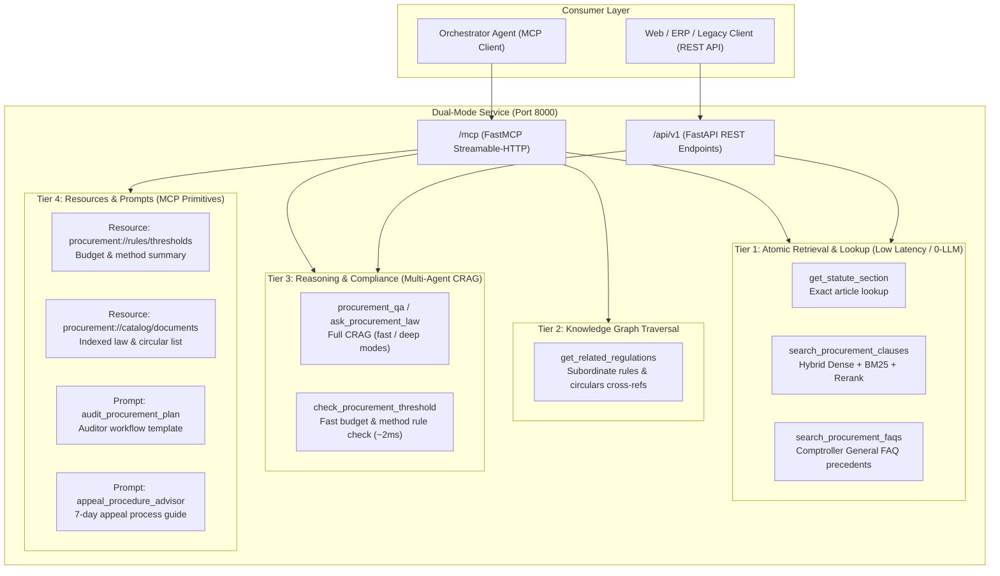

# Production LegalGraphRAG: Multi-Tier MCP & REST Server for Thai Government Procurement

This document defines the architecture, tool contracts, dual-protocol exposure (MCP + REST API), and production deployment guide for the **LegalGraphRAG Procurement Sub-Agent**.

---

## 1. Architectural Overview & 4-Tier Design

Rather than exposing a single monolithic tool, the system provides a **4-Tier specialized interface** optimized for outer orchestrator agents (e.g., Enterprise Procurement Copilots, Compliance Auditor Agents, LangGraph/AutoGen workflows) and traditional REST clients.



---

## 2. Tool, Resource & Prompt Specifications

### 🛠️ Tier 1: Atomic Retrieval & Lookup (Zero-LLM Cost, 50–300ms)

Fast fact-retrieval tools designed for agents that already know what they are searching for and do not require multi-agent generative reasoning.

1. **`get_statute_section(doc_title: str, section: str) -> dict`**
   - **Description**: Exact verbatim statutory lookup. Retrieves the precise clause text, title, and topic annotations without hallucination.
   - **Example**: `doc_title="พระราชบัญญัติการจัดซื้อจัดจ้างฯ พ.ศ. 2560"`, `section="56"`
   - **Returns**: `{"found": true, "doc_title": "...", "section": "...", "content": "...", "topics": [...]}`

2. **`search_procurement_clauses(query: str, top_k: int = 5, doc_filter: Optional[str] = None) -> dict`**
   - **Description**: Direct hybrid search (Dense Vector + Thai BM25 + Cross-Encoder Reranker) over statutory clauses *without* LLM synthesis.
   - **Returns**: `{"results": [{"score": 0.89, "entry": "...", "content": "...", "doc_title": "..."}]}`

3. **`search_procurement_faqs(query: str, top_k: int = 3) -> dict`**
   - **Description**: Semantic search through official Comptroller General's Department (กรมบัญชีกลาง) Q&A and consultation rulings (`cases_with_feature.json`).
   - **Returns**: `{"results": [{"question": "...", "answer": "...", "law_reference": "..."}]}`

---

### 🕸️ Tier 2: Knowledge Graph Traversal (10–50ms)

4. **`get_related_regulations(section_reference: str) -> dict`**
   - **Description**: Traverses the NetworkX knowledge graph (`openrouter_graph_db.pkl`) to locate subordinate legislation (กฎกระทรวง), finance ministry regulations (ระเบียบกระทรวงการคลังฯ), or committee circulars (หนังสือเวียน ว.) linked to a parent statutory section.
   - **Returns**: `{"parent": "มาตรา 56", "related_subordinates": [{"entry": "ข้อ 79", "relation": "IMPLEMENTS"}, ...]}`

---

### 🧠 Tier 3: Reasoning & Compliance (Multi-Agent CRAG)

5. **`procurement_qa(question: str, mode: str = "deep") -> dict`** (Alias: `ask_procurement_law`)
   - **Description**: Executes the Multi-Agent Corrective RAG (CRAG) pipeline with Guardrails for open-ended legal inquiries, statutory interpretation, dispute resolution, and exceptions.
   - **Parameters**:
     - `question` (str): Inquiring legal question in Thai or English.
     - `mode` ("deep" | "fast"):
       - `"deep"` (default): Full CRAG loop (Decomposer $\rightarrow$ Multi-retrieval $\rightarrow$ Synthesizer $\rightarrow$ Completeness Auditor $\rightarrow$ Targeted Refiner Retry).
       - `"fast"`: Single-pass hybrid retrieval + Synthesizer (skips auditor/refinement retry, latency ~3-4s).
   - **Returns**:
     ```json
     {
       "status": "OK",
       "mode": "fast",
       "direct_answer": "...",
       "decisive_quotes": [
         {
           "filename": "พระราชบัญญัติการจัดซื้อจัดจ้างและการบริหารพัสดุภาครัฐ พ.ศ. 2560.md",
           "page": "18-20/42",
           "law": "มาตรา ๕๖ (๒) (ข)",
           "quote": "..."
         }
       ],
       "applicable_laws": ["มาตรา ๕๖ (๒) (ข)", "ข้อ ๗๙"],
       "exceptions_or_conditions": "...",
       "citations": [{"entry": "...", "topics": ["..."]}],
       "crag_meta": {"issues": [...], "retries": 0, "audited_complete": true}
     }
     ```

6. **`check_procurement_threshold(procurement_item: str, estimated_budget: float, proposed_method: str, justification_reason: Optional[str] = None) -> dict`** (Alias: `verify_procurement_compliance`)
   - **Description**: Fast deterministic statutory ceiling audit (~2ms, 0-LLM cost). **Trigger Immediately** when the user specifies a concrete budget number and asks whether a procurement method is permitted (e.g. *"Can 450,000 THB use Specific Selection?"*), or to perform pre-/post-approval validation.
   - **Parameters**:
     - `procurement_item` (str): Item or service name.
     - `estimated_budget` (float): Budget amount in THB.
     - `proposed_method` (str): e.g. `"เฉพาะเจาะจง"`, `"e-bidding"`, `"คัดเลือก"`.
     - `justification_reason` (Optional[str]): e.g. `"จำเป็นเร่งด่วน"`, `"มีตัวแทนจำหน่ายรายเดียว"`.
   - **Returns**:
     ```json
     {
       "is_compliant": true,
       "compliance_status": "PASSED",
       "statutory_threshold": "วงเงินไม่เกิน 500,000 บาท ตามกฎกระทรวง...",
       "required_approvals": ["หัวหน้าเจ้าหน้าที่", "หัวหน้าหน่วยงานของรัฐ"],
       "potential_risks": []
     }
     ```

---

### 📦 Tier 4: Native MCP Resources & Prompts

#### Resources (Direct Context Ingestion)
- **`procurement://rules/thresholds`**: Pre-compiled statutory monetary thresholds, procurement method conditions, and mandatory appeal deadlines (0 latency, 0 token cost).
- **`procurement://catalog/documents`**: Master index of available statutes, regulations, and circular letters in the active knowledge graph.

#### Prompts (Standardized Workflow Templates)
- **`audit_procurement_plan`**: Orchestrator prompt template for auditing draft procurement plans against Thai regulations.
- **`appeal_procedure_advisor`**: Guidance template for verifying bidder disqualification rights, appeal conditions, and the statutory 7-day appeal filing window.

---

### 🌐 Dual Protocol: REST API Compatibility Endpoints

For non-MCP clients (e.g. web frontends, Postman, legacy ERP systems), the server exposes standard HTTP endpoints on the same port:

- `POST /api/v1/qa`: JSON body `{"question": "...", "mode": "deep"}` $\rightarrow$ returns streamlined legal QA response (`mode`, `direct_answer`, `decisive_quotes`).
- `POST /api/v1/search`: JSON body `{"query": "...", "top_k": 5}` $\rightarrow$ returns raw retrieved clauses.
- `POST /api/v1/verify`: JSON body `{"procurement_item": "...", "estimated_budget": 500000, "proposed_method": "..."}` $\rightarrow$ compliance audit.
- `GET /healthz`: Liveness probe (returns `{"status": "alive"}`).
- `GET /ready`: Readiness probe (returns `{"ready": true, "graph_loaded": true, "model": "..."}`).

---

## 3. Production Deployment & Containerization

### Dockerfile Highlights
- Python 3.11-slim base image.
- Pre-cached dependencies and model weights.
- Multi-worker or async event loop handling streamable-http and REST routes concurrently.
- Readiness & Liveness probes for Kubernetes / Docker Compose health checks.

### Environment Configuration (`.env`)
```bash
# Model Provider
model_name=openrouter
OPENROUTER_API_KEY=your-api-key-here
OPENROUTER_MODEL=google/gemini-2.5-flash

# Transport & Host
MCP_TRANSPORT=streamable-http
MCP_HOST=0.0.0.0
MCP_PORT=8000

# Pipeline Settings
crag_enabled=True
crag_max_retry=1
reranker_device=cpu # or cuda:0 if NVIDIA Container Toolkit is enabled
```

### Running with Docker Compose
```bash
docker compose build
docker compose up -d
```

Check health:
```bash
curl http://localhost:8000/ready
```

---

## 4. Testing & Verification

1. **MCP Client Smoke Test**:
   ```bash
   python scripts/test_mcp_client.py --url http://localhost:8000/mcp
   ```
2. **REST API Smoke Test**:
   ```bash
   curl -X POST http://localhost:8000/api/v1/qa \
        -H "Content-Type: application/json" \
        -d '{"question": "วิธีเฉพาะเจาะจงวงเงินไม่เกินเท่าใด", "mode": "fast"}'
   ```
3. **MCP Inspector**:
   ```bash
   mcp dev mcp_server.py
   ```
